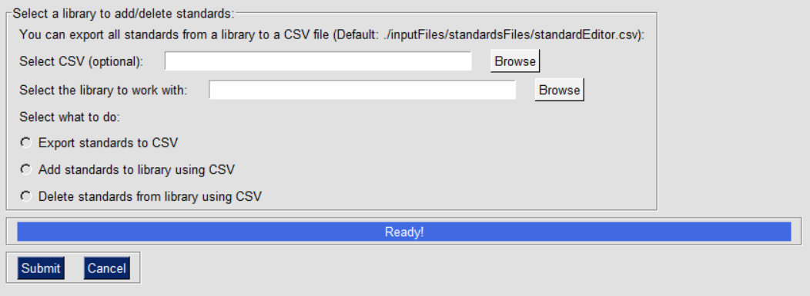
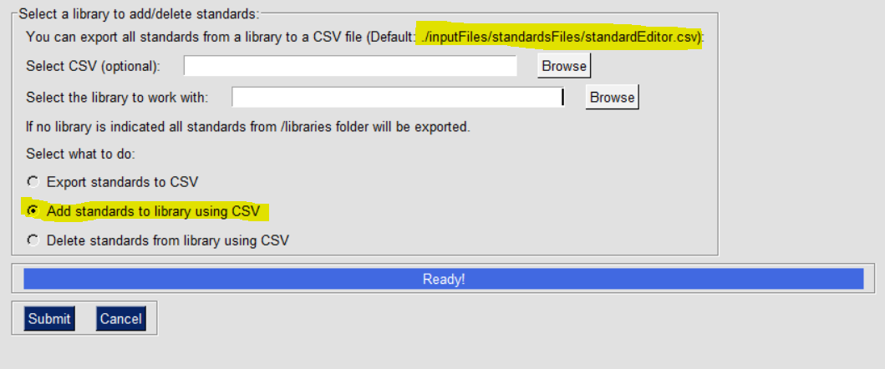
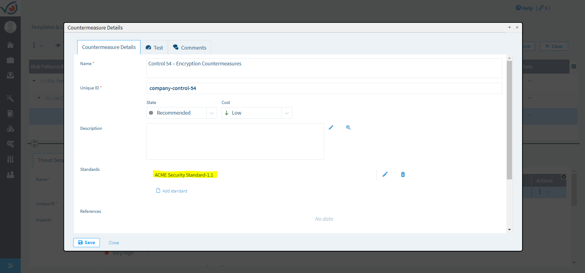

IriusRisk Toolkit UI : Add standard to libraries
=======================================================================    
 
Launch IriusRiskToolkitUI by executing the following command:  
  
``` 
python IriusRiskToolKitUI.py
```

This will open a GUI. Among them is the option "Add Standard to library or libraries":


This option has three possible choices:

* Export standards to CSV: A CSV file composed by six columns (Library, Component, Control, Supported Standard Name, Supported Standard Ref, Standard Ref) will be created in inputFiles/standardsFiles/standardEditor.csv, except if you indicate a different file with the “Select CSV” browse option.
* Add standards to library using CSV: Once the exported CSV has been modified leaving only those controls that need a standard this file will be used to modify the selected library.
* Delete standards to library using CSV: Same as before, but removing the standards from the controls listed in the CSV file.

The library to work with can be selected using the browse button:



**Note**: If no library is selected the process will go through every library in /libraries folder inside the toolkit.

Depending of the selected choice the result will be a message indicating where are the files saved:


The workflow to use this process should be the following:
* First step is to export all standards from the desired library or from all libraries
* After that you need to edit the standardEditor.csv file to add or remove rows as you wish
* Once you finish editing the CSV you will have to use the options "Add" or "Delete" on the menu above
  * This options will go through every row on the modified CSV and add or delete the standard on the corresponding countermeasures.

**Important**: "Add standards..." option is an additive process, meaning that the process to add new rows will work whether the CSV contains all the previously exported rows plus the new ones or only the new ones. This is not a big deal when adding but it won't work the same when deleting. You must ensure that if you want to remove standards you must only have the rows to be deleted in the CSV. 

**Example**: The "ACME Security Standard" has a requirement that is detailed as "1.1 - Encrypt data in transit" 
and we want to link the countermeasures that are related with that requirement in three of our libraries: A, B and C.

First step is to list the countermeasures that we want to relate with that requirement by identifying the desired countermeasures in IriusRisk. 
Therefore, we must review the list of countermeasures to see which ones are applicable.

Suppose that we have identified only one countermeasure called "Control 54 - Encryption Countermeasures"
that appears once in A and C and twice in B.

Then we open the CSV using the delimiter "#" to add the following lines:


We save the file and then we use the toolkit to add the CSV content to the libraries using the corresponding option:


The process will read the CSV and link the ACME standard requirement with the countermeasures in libraries A, B and C at the same time.

Now you should see the standard correctly applied in IriusRisk:


[Back to index](Readme.md)