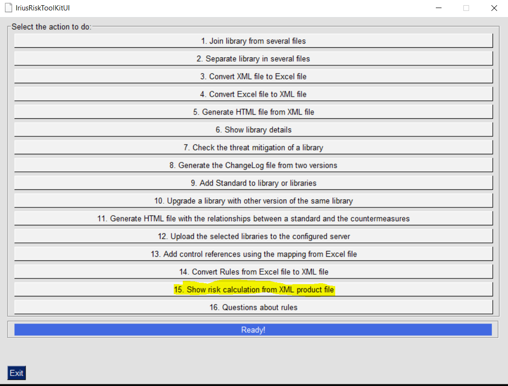
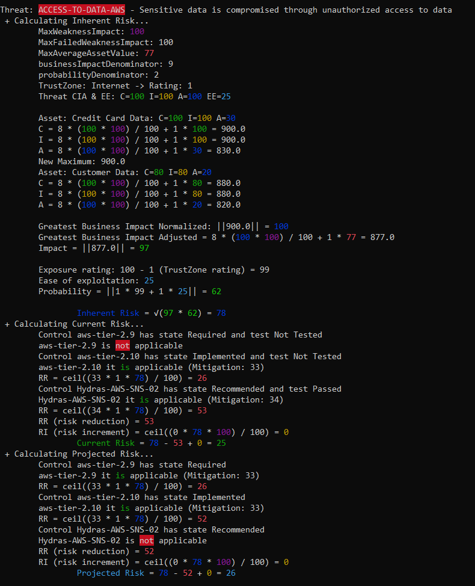
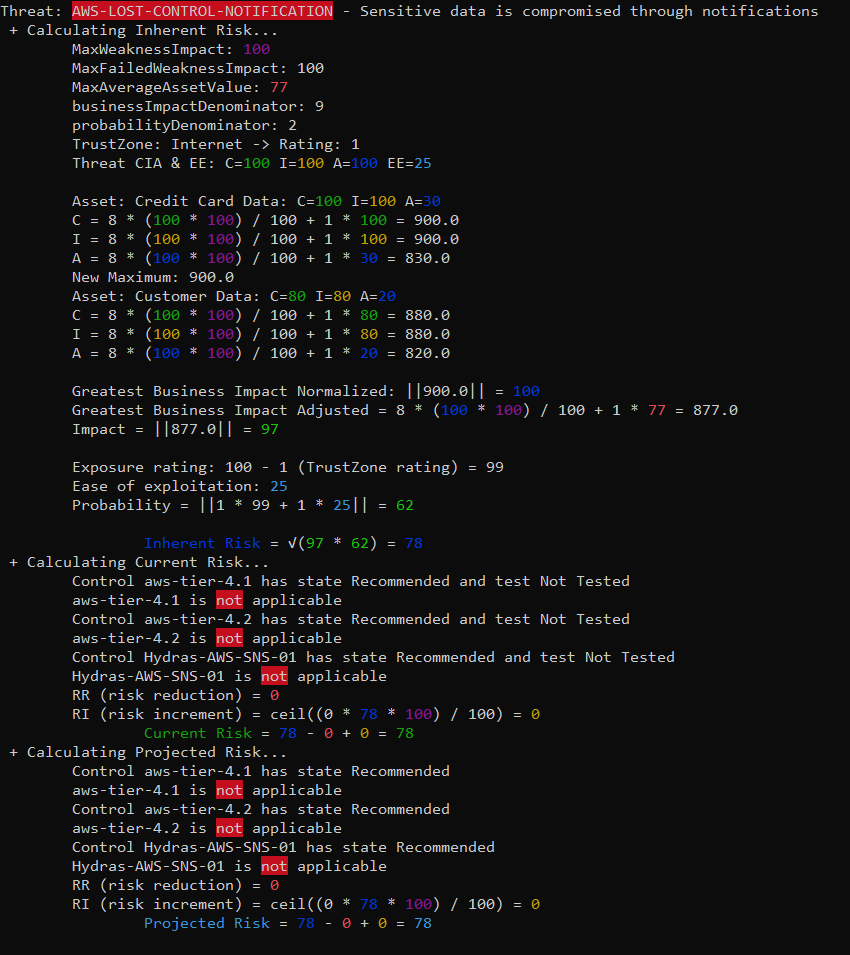

IriusRisk Toolkit UI : Show detailed risk calculation
============================================================================    

Configuration 
-------------

First of all we have to configure some parameters to make this work:

-   **For impact calculation:**

    -   **BIw** = Business Impact weighting (&gt;0)

    -   **Aw** = Asset Value weighting (&gt;0)

-   **For probability calculation:**

    -   **EXw** = Exposure weighting (&gt;0)

    -   **EEw** = Ease of exploitation weighting (&gt;0)

-   **For risk reduction calculation:**

    -   **TestPassedFactor** = 1

    -   **TestNotPassedFactor** = 1

    -   **TestImplementedFactor** = 1

-   **For risk increment calculation:**

    -   **VulnFoundFactor** = 0

Algorithm 
---------

After setting the configuration, for every threat in every component in
the diagram model:

1.  Calculate one-time calculation data:

    1.  Calculate the **greatest weakness impact** value \[0-100\]: from
        all the weaknesses in threat, the one with the highest impact
        value.

    2.  Calculate the **greatest failed weakness impact** \[0-100\]:
        from all the weaknesses with failed test in threat, the one with
        the highest impact value.

    3.  Calculate the **maximum average asset value** \[0-100\]: from
        all the assets related to the component, the maximum of the
        averages of CIA values.

2.  Calculate **[Inherent Risk]**: the
    risk that the threat has without any countermeasures applied

    1.  Calculate the **greatest business impact** by taking the
        **maximum** value after applying the following formulas for
        **every** asset **related to the component**:

    2.  

        Adjust the **greatest business impact** to be within the range
        \[0-100\]:

        

    3.  Calculate **impact**: how much this threat affects to the
        business. Apply a weighted mean using the **greatest business
        impact** and the **maximum average asset value** and adjust the
        value after that:

        **Impact** =

        

    4.  Calculate **probability**: how likely is this threat to occur.
        Use the following weighted mean which represents how much
        exposed is this threat according to the trust zone and the ease
        of exploitation:

        **Probability** =

        

    5.  Calculate inherent risk using the following formula:

        **[Inherent risk]** =

        

3.  Calculate **[Current Risk]**: the
    actual risk after applying countermeasures

    1.  Calculate risk reduction: how much the risk can be mitigated
        with current countermeasures. For **every** control within the
        weaknesses in threat, sum the value given by the following
        formula **if control test is passed [or
        ]is implemented and test is not
        failed**:

        

        *Factor* is given by **TestPassedFactor** if the first condition
        is true and **TestImplementedFactor** if the first condition is
        false and the second condition is true.

    2.  Calculate risk increment: increment produced for failing
        weakness. Use the following formula:

        

    3.  **[Current risk]** =
        **[Inherent risk]** - Risk
        reduction + Risk increment

4.  Calculate **[Projected Risk]**: the
    risk that is estimated to exist after all countermeasures have been
    applied

    1.  Calculate risk reduction: how much the risk can be mitigated
        with current countermeasures. For **every** control within the
        weaknesses in threat, sum the value given by the following
        formula **if control is implemented or required**:

        

    2.  Calculate risk increment: increment produced for failing
        weakness. Use the following formula:

        

    3.  **[Projected risk]** =
        **[Inherent risk]** - Risk
        reduction + Risk increment

5.  After all risk values have been calculated, final values will be the
    average of each category:

    **Architecture Inherent Risk** =

    

    Same for current risk and projected risk.

Script 
------

An utility has been made to calculate risk from an IriusRisk template.   

``` 
python riskCalculatorCLI.py products/<product.xml>
```    

Also, risk calculation can be generated through IriusRisk Toolkit UI:



This option generates an HTML file with the same information.

Examples 
--------





    
